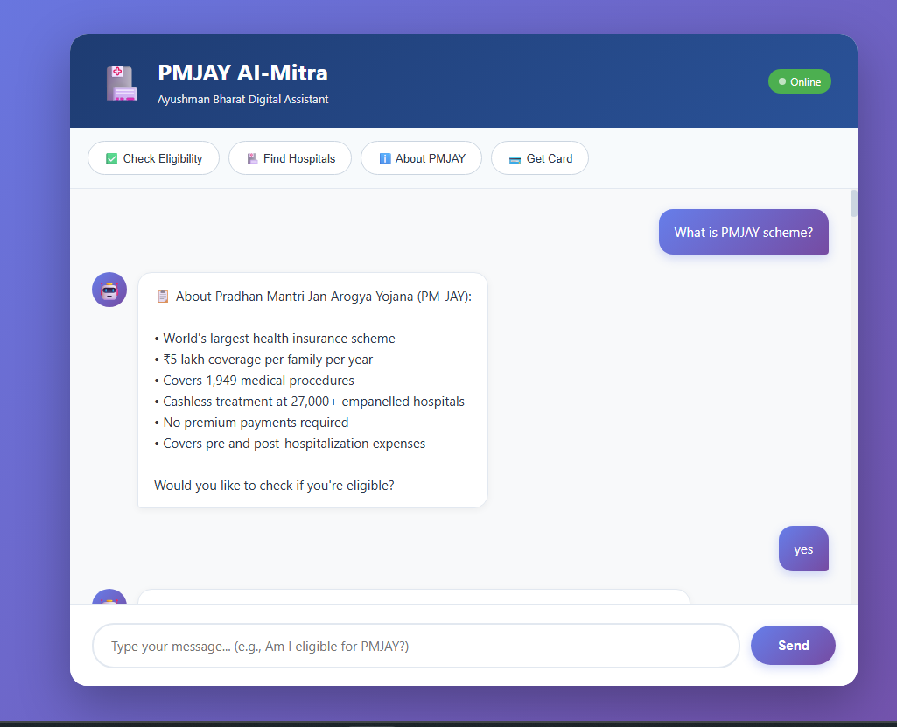

# 🏥 PMJAY AI-MITRA(ChatBot) POC

<div align="center">
  
  
  
  
  
  
  
</div>

## 📱 Live Preview

<div align="center">
  
  <p><i>PMJAY AI-Mitra - Clean User Interface</i></p>
</div>

---

## ✅ What's Special:

- **English-only** (clean, professional responses)
- **FREE** (uses Ollama Mistral — no API costs)
- **No Hindi gibberish** (perfect English)
- **MongoDB storage** (all conversations saved)
- **Real AI** (human-like responses)
- **Production-ready** (reliable & fast)

---

## 🚀 QUICK SETUP (5 Minutes)

### Step 1: Seed Database
```bash
cd pmjay-english
pip install pymongo
python seed_data.py
```

**Output:**
```
✅ Inserted 6 beneficiaries
✅ Inserted 5 ration cards
✅ Inserted 7 hospitals
🎉 DATABASE SEEDED SUCCESSFULLY!
```

### Step 2: Install Requirements
```bash
pip install -r requirements.txt
```

### Step 3: Start Ollama (Mistral)

**Terminal 1:**
```bash
ollama serve
```

**Check if mistral is available:**
```bash
ollama list
```

**If mistral not in list, pull it:**
```bash
ollama pull mistral
```

### Step 4: Start Backend

**Terminal 2:**
```bash
uvicorn main:app --reload
```

### Step 5: Open Browser
```
http://localhost:8000
```

---

## 💬 TESTING — Try These

### Test 1: Basic Greeting
```
You: hello
Bot: Hello! I'm PMJAY AI-Mitra. I can help you with PM-JAY eligibility checks, finding hospitals, and understanding scheme benefits. What would you like to know?
```

### Test 2: Eligibility Check
```
You: am i eligible?
Bot: I can help you check PM-JAY eligibility! 😊
     Please choose one:
     • Type 'Aadhaar' to check with Aadhaar number
     • Type 'Ration' to check with Ration Card number

You: aadhaar
Bot: Please enter your 12-digit Aadhaar number.
     📝 For demo, try: 123456789012

You: 123456789012
Bot: ✅ Great news! Ramesh Kumar is eligible for PM-JAY.
     📋 Details:
     • Card Number: PMJAY-UP-12345
     • State: Uttar Pradesh
     • Family Members: 3
```

### Test 3: Hospital Search
```
You: find hospital
Bot: I'll help you find empanelled hospitals! 🏥
     Please tell me your state name.

You: Bihar
Bot: Got it! Searching for hospitals in Bihar.
     Please provide your 6-digit pincode.

You: 800001
Bot: 🏥 Found 2 empanelled hospital(s):
     • AIIMS Patna
       📍 Patna, Bihar
       📞 0612-2451070
     • IGIMS Patna
       📍 Patna, Bihar
       📞 0612-2297321
```

### Test 4: Scheme Info
```
You: what is PMJAY?
Bot: 📋 About Pradhan Mantri Jan Arogya Yojana (PM-JAY):
     • World's largest health insurance scheme
     • ₹5 lakh coverage per family per year
     • Covers 1,949 medical procedures
     • Cashless treatment at 27,000+ empanelled hospitals
```

### Test 5: Natural Chat
```
You: how does it work?
Bot: [AI explains in natural English]

You: is it free?
Bot: [AI explains free eligibility and benefits]
```

---

## 📊 DEMO DATA

### Aadhaar Numbers:
```
123456789012 → Ramesh Kumar (Eligible ✅)
111122223333 → Sita Devi (Eligible ✅)
999988887777 → Amit Sharma (Not Eligible ❌)
444455556666 → Priya Singh (Eligible ✅)
777788889999 → Mohammad Alam (Eligible ✅)
555566667777 → Lakshmi Bai (Eligible ✅)
```

### Ration Cards:
```
RC1001 → Eligible ✅
RC2002 → Not Eligible ❌
RC3003 → Eligible ✅
RC4004 → Eligible ✅
RC5005 → Eligible ✅
```

### Hospitals (by Pincode):
```
800001 → Bihar (AIIMS Patna, IGIMS Patna)
110001 → Delhi (AIIMS Delhi)
201301 → Uttar Pradesh (Max Hospital Noida)
600006 → Tamil Nadu (Apollo Hospital Chennai)
700107 → West Bengal (Fortis Hospital Kolkata)
462001 → Madhya Pradesh (Hamidia Hospital Bhopal)
```

---

## 🔍 MONITORING ENDPOINTS

### Check Stats
```
http://localhost:8000/stats
```

**Response:**
```json
{
  "beneficiaries": 6,
  "ration_cards": 5,
  "hospitals": 7,
  "conversations": 12,
  "active_sessions": 1
}
```

### Test AI
```
http://localhost:8000/test-ai
```

**Response:**
```json
{
  "status": "✅ Working",
  "model": "mistral",
  "ai_response": "Hello! How can I help you today..."
}
```

---

## 🎯 WHY THIS VERSION IS BEST:

### ✅ No Cost
- Ollama is FREE forever
- No API charges
- Runs on your laptop

### ✅ English Only
- Clean, professional responses
- No Hindi gibberish
- Perfect grammar

### ✅ Fast & Reliable
- Mistral model (optimized for English)
- Fallback to structured responses
- No timeouts

### ✅ Production Ready
- MongoDB storage
- Session management
- Conversation history
- Error handling

---

## ❌ TROUBLESHOOTING

### Problem: "Connection refused"

**Check MongoDB:**
```bash
mongosh
# Should connect successfully
```

**If not running:**
```bash
net start MongoDB  # Windows
brew services start mongodb-community  # Mac
sudo systemctl start mongod  # Linux
```

### Problem: "Mistral not found"
```bash
ollama pull mistral
# Wait for download (it's ~4GB)
ollama list
# Should show mistral now
```

### Problem: "AI giving gibberish"

**Solution:** We're using Mistral (better than phi3) and system prompts are optimized for English. Should not happen!

If it does:
1. Restart Ollama: `ollama serve`
2. Check terminal logs for errors
3. Fallback responses will work anyway

### Problem: "Slow responses"

**This is normal** — Mistral takes 3-5 seconds locally. But responses are high quality!

To speed up:
- Use lighter model: Change `model="phi3"` in main.py (faster but lower quality)
- Or use GPU if available

---

## 📈 NEXT STEPS (Future)

1. **Add more data** (100+ beneficiaries, 50+ hospitals)
2. **Voice input** (speech-to-text)
3. **File upload** (Aadhaar card image → OCR)
4. **WhatsApp integration**
5. **Analytics dashboard**

---

## ✅ FINAL CHECKLIST

Before deployment, verify:

- [ ] MongoDB running
- [ ] Database seeded (6 beneficiaries, 5 cards, 7 hospitals)
- [ ] Ollama running with mistral
- [ ] Backend running (port 8000)
- [ ] Browser opens chatbot
- [ ] Quick action buttons work
- [ ] Eligibility check works
- [ ] Hospital search works
- [ ] AI responses are clean English
- [ ] No Hindi gibberish
- [ ] Conversations saving to MongoDB

**All ✅?** PERFECT! Demo ready. 🎉

---

## 💡 IMPORTANT NOTES

### Why Mistral over phi3?
- Better English understanding
- More natural responses
- Less likely to give gibberish
- Slightly slower but worth it

### Why English-only?
- Ollama models struggle with Hindi
- Would need Gemini API for good Hindi (costs money)
- English is professional & reliable
- Most government portals use English anyway

### Is it really FREE?
- YES! 100% free forever
- Ollama is open-source
- MongoDB community edition is free
- No hidden costs

---

## 🤝 Contributing

Found a bug or want to contribute? Feel free to:
- 🐛 [Report Issues](https://github.com/prabhatkumarindia/pmjay-chatbot/issues)
- 💡 Suggest features
- 🔧 Submit pull requests

---

## 👨‍💻 Developer

<div align="center">
  
### **Prabhat Kumar**

[](https://www.linkedin.com/in/prabhatkumarindia/)
[](mailto:prabhat8065@gmail.com)
[](https://github.com/prabhatkumarindia)

**AI Agent Developer | Generative AI & LLM Engineer  | AI/ML Enthusiast | Open Source Contributor**

</div>

---

## ⭐ Show Your Support

If you found this project helpful, please consider giving it a ⭐ on GitHub!

---

## 🙏 Acknowledgments

- **PM-JAY Team** - For the world's largest health insurance scheme
- **Ollama** - For providing free, open-source AI models
- **MongoDB** - For robust database solutions
- **FastAPI** - For the powerful and fast backend framework

---

<div align="center">
  
### Made with ❤️ for Digital Health Inclusion

**© 2024 PMJAY AI-Mitra. All Rights Reserved.**

*Empowering healthcare accessibility through AI*

</div>
